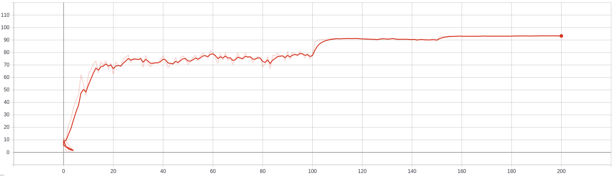

# SNIP-pytorch
Evaluate sensitivity of channel/vector connections to decrease width/depth of network. Which will accelerate inference speed and reduce storage usage without any other modules or sparse multiplications

This implementation is based on [SNIP paper](https://arxiv.org/abs/1810.02340) and calculate group sensitivity in Linear and Conv2d.

The sparsitiy level, k doesn't mean compression rate anymore in here. Because I sort each connections in group, so meaning slightly changed.

If you have any question or find any issue, please [let me know](../..//issues)!

## Requirements

 * [pytorch 1.5.0](https://pytorch.org/get-started/previous-versions/#v150)
 * [torchsummary ](https://github.com/sksq96/pytorch-summary)
 * torchvision 0.6.0
 * tqdm
 * tensorflow, this is for tensorboard
 * scipy 1.4.1

## Usage

Below are some usage examples, to apply your own model. For more details, please read train.py. 
```python
# This is general case
import torch
import SNIP

device = torch.device(args.device)
model = build_model(model_name, num_classes, pretrained)
model = model.to(device)
snip = SNIP(model, device, kappa = 0.5)

train_loader = data_loader() # generate input x and y
input_x, input_y = next(iter(train_loader))
input_x, input_y = input_x.to(device), input_y.to(device)

compressed_model, comp_rate = snip.construct_small_network(input_x, input_y)
# Now you can use compressed_model to train
```

## Performances on cifar10

To check benchmarks for more original performances, you can see from [here, others' implementation](https://github.com/kuangliu/pytorch-cifar)
> The results below are based on batch_size = 1 setting with eval.py code.

| Model | comp rate |Accuracy | FPS | # of parameters | memory usage | param size |
|-------|:---------:|:-------:|:---:|:---------------:|:-------------:|:------------:
| vgg16_bn | 0% | 93.87% |  |  | 1637mb |  |
| vgg16_bn | 69% | 93.26% |  |  | 925mb |  |
| vgg16_bn | 88% | 92.81% |  |  | 751mb |  |
| resnet50 | 0%  | 95.11% |  |  | 781mb |  |
| resnet50 | 25%  | 95.18% |  |  | 729mb |  |
| mobilenetv2 | 0%  | 93.87% |  |  | 567mb | 8.76mb |
| mobilenetv2 | 45%  | 93.68% |  |  | 543mb | 4.75mb |

Memory usages are measured with `nvidia-smi` command.  
Compression rates are computed based on number of parameters from 0% models.  
I got param size using torchsummary. You can see more details related to model size if you eval your model.


Accuracy graph with vgg16_bn, comp rate 60% on cifar10 test:



## Reference
  - [Another pytorch implementation of SNIP](https://github.com/mi-lad/snip)
    - I refered forward overriding and getting mask parts(snip.py), nice implementation!
  - [Official code, Tensorflow implementation](https://github.com/namhoonlee/snip-public)
  - [SNIP: Single-shot Network Pruning based on Connection Sensitivity (ICLR 2019)](https://arxiv.org/abs/1810.02340)
